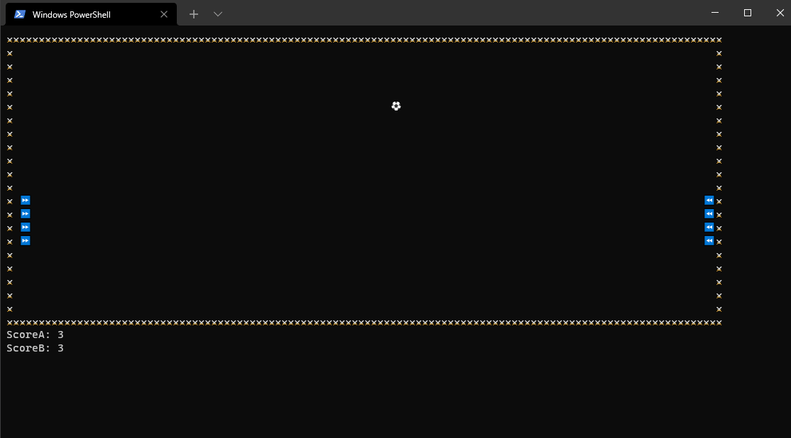

# PingPong v1.1

## Overview

This is a fork of the original PingPong repository to add support for emojis and special characters on Windows.



## Notes

The Windows cmd won't display these characters - you'll want to install the "Windows Terminal" app (shown above), which can be found in the Microsoft Store. You can then run your app in this terminal.

You may also have to resize the window a bit to get pdcurses to work.

## What's Changed

### Code

Of the PingPong app's source files, only the GameManager files are modified.

In the header file (`GameManager.h`), the strings are now `wstring`s, which allows them to contain the desired special characters.

In addition, there is this helper macro, which constructs a `wstring` from a Unicode codepoint:

```cpp
#define MAKE_STR(x) { (wchar_t)x, 0 }
```

There is also a new `GameManager::printEmoji()` function, which takes one of these `wstring`s and properly displays it using the appropriate ncurses/pdcurses API function for Windows or Linux.

```cpp
void GameManager::printEmoji(const std::wstring& str) {
#ifdef _WIN32
    addrawch(str[0]);
#else
    addwstr(str.data());
#endif
}
```

### UI

The player symbols have changed, from "🔰" to "⏩" and "⏪" for players A and B, respectively. The original symbol is outside Unicode plane 0 and thus won't display in many terminals or fonts.

### Libraries

Support for wide strings in pdcurses requires a special build of the library with `PDC_WIDE` defined during compile.

A minimal copy of pdcurses v3.9 for Windows has been placed into the repository, with a simple Makefile included for building with the required settings.

## Compiling

Compiling PingPong v1.1 is similar to the process for v1.0, with the only difference being the steps to build pdcurses on Windows. (You will only need to build it once.)

```bash
cd path_to_local_code
cd PDCurses-3.9-Windows  # Windows only
make                     # Windows only
cd ..                    # Windows only
make
```

## Platform Support

PingPong v1.1 has been tested on the following 64-bit platforms and compilers:

- **Ubuntu 20.04** (Linux)
  - g++ 9.3.0
  - clang++ 10.0.0
- **Fedora Workstation 34** (Linux)
  - g++ 11.1.1
  - clang++ 12.0.0
- **Windows 10** (Windows)
  - g++ 10.3.0 (on MSYS2)
  - MSVC 19.29 (built manually)

## Code Explanations

The `MAKE_STR` macro works on the principle that you can initialize a `wstring` with an array of `wchar_t`s. In this initialization method, each `wchar_t` is an integer codepoint to a Unicode character. The last element is 0 to null-terminate the string.

```cpp
// For example:
const std::wstring NEW_BALL_SYMBOL = MAKE_STR(0x26BD);

// Expands to:
const std::wstring NEW_BALL_SYMBOL = { (wchar_t)0x26BD, 0 };
```

`NEW_BALL_SYMBOL` now contains the singular character U+26BD. If you reference a [Unicode table](https://unicode-table.com/en/), you will see that this codepoint corresponds to the soccer ball emoji. All other strings in `GameManager` are initialized similarly.\
\
The `GameManager::printEmoji()` function has an `#ifdef _WIN32 ... #else ... #endif` block for conditional compilation:

```cpp
void GameManager::printEmoji(const std::wstring& str) {
#ifdef _WIN32
    // This code block gets compiled on Windows only.
    // (The "32" part is irrelevant; this works on both 32-bit and 64-bit Windows.)
    addrawch(str[0]);
#else
    // This code block gets compiled on non-Windows only.
    // Usually this targets Linux or other *nixes.
    addwstr(str.data());
#endif
}
```

This is because `addrawch()` is present in pdcurses (Windows) while `addwstr()` is present in ncurses (*nix).

`addrawch()` expects a `wchar_t` as a parameter. We can use `[0]` to turn the `wstring`s in `GameManager` into `wchar_t`s. Even though this means "get the first element of the string", this detail is irrelevant because the `wstring`s just contain a single character.

`addwstr()` expects a `wchar_t*` as a parameter - call `.data()` to get the `wstring` in this format.
